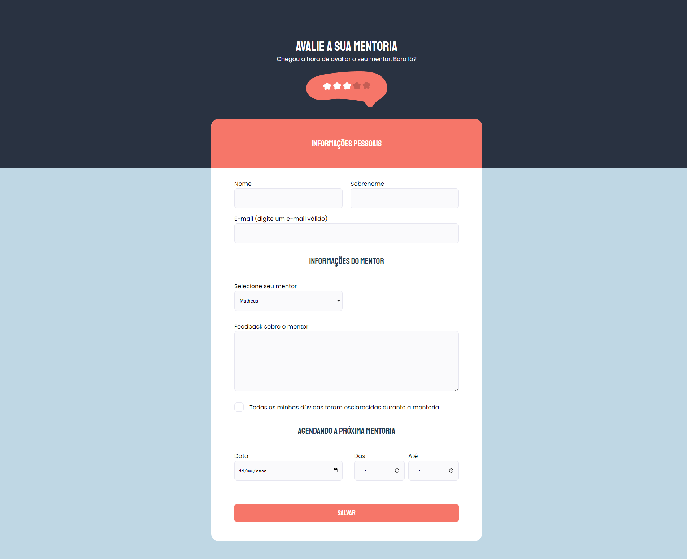

# Advanced Form

## A form with several different inputs for the user to submit

> Project built during classes on the Explorer trail at Rocketseat educational institution.
> 
> The objective was building the application's HTML and CSS from a Figma model, with emphasis on the styling of the input and checkbox fields.

🔗 [Click here to access](https://matheusborgesdev.github.io/Advanced-form/)

## 💻 Technologies

- HTML
- CSS
- Git & Github
- Figma

## 📧 Contact

matheusb.dev@gmail.com
